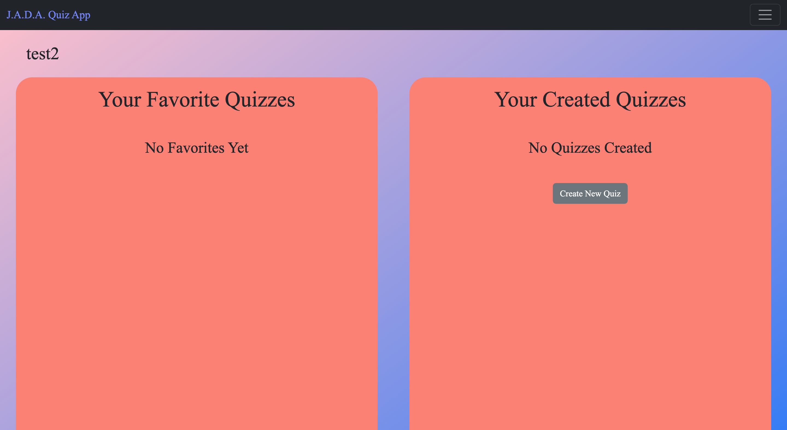
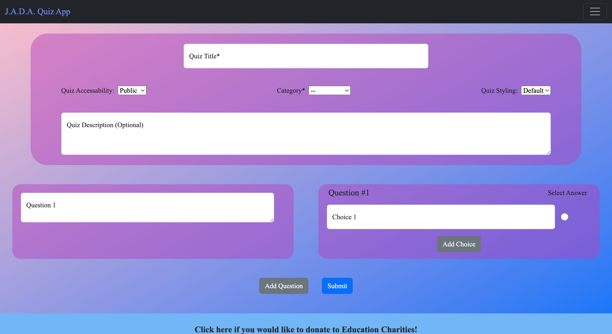
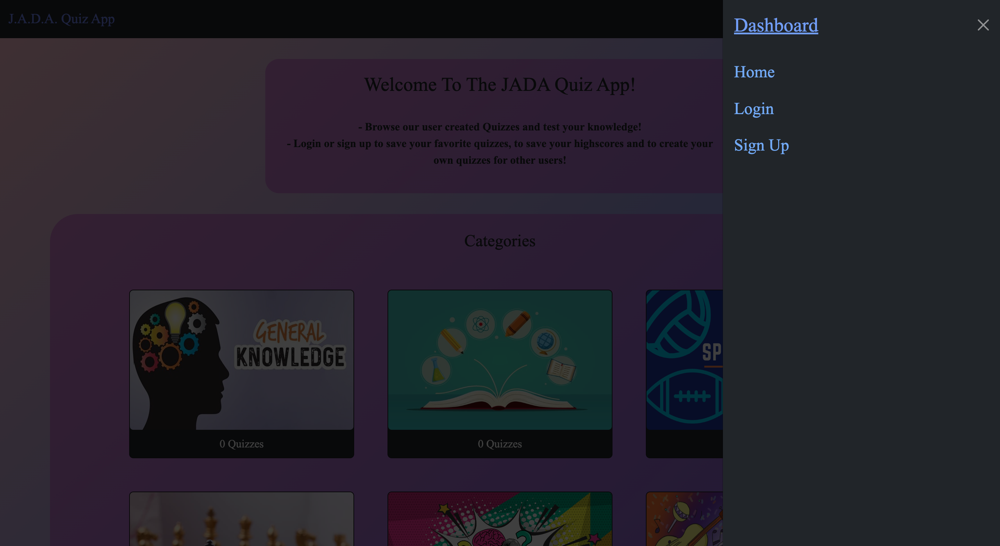
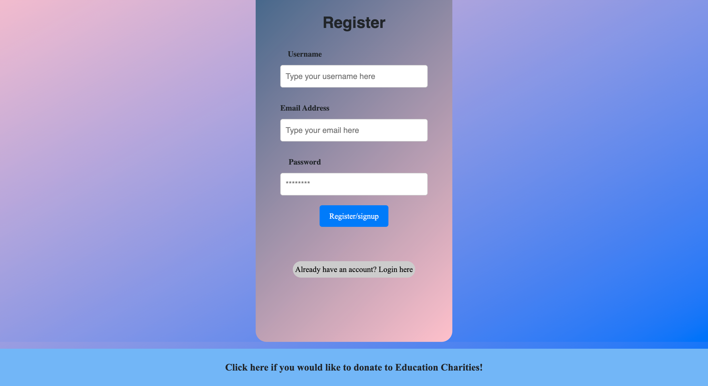
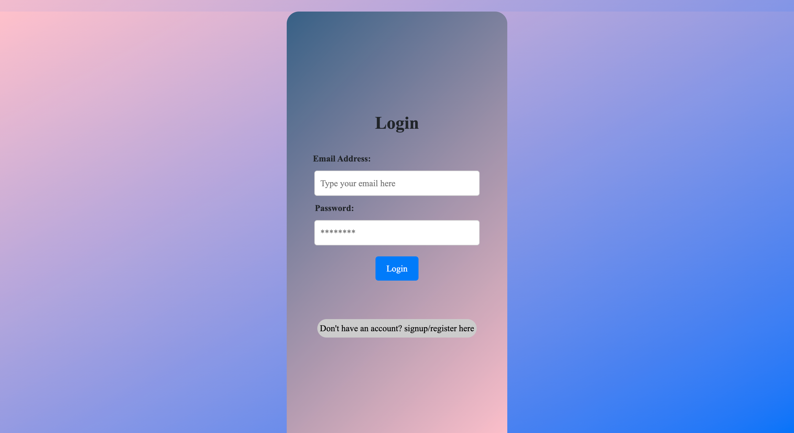
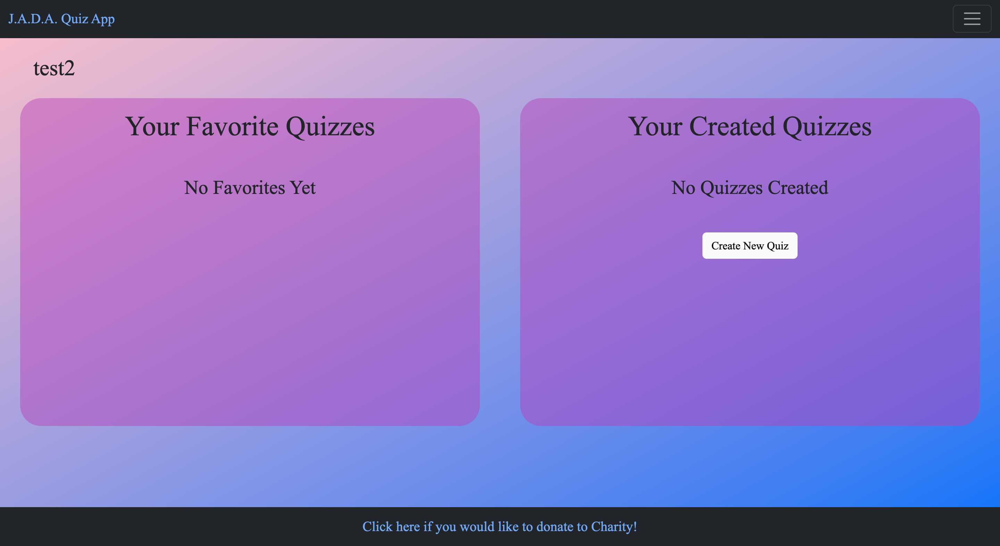

# JADA-Quiz-App

## Description

[deployed application](https://jada-quiz-app.herokuapp.com/)

We created an application for users to create and play different quizzes to test their knowledge. This is a full-stack application that uses Apollo server, GraphQL as our query language, Mongoose and MongoDB for our database, Express for our web framework, and React for our frontend. Our site is styled using Bootstrap and React-Bootstrap CSS libraries.

## Table of Contents 

- [Installation](#installation)
- [Usage](#usage)
- [Collaborators](#collaborators)
- [License](#license)

## Installation

No necessary installations needed, just view our deployed link https://jada-quiz-app.herokuapp.com/

## Usage

Attached below are screenshots of how our website looks:
    
    
    
    
    
    
    

## Collaborators
 
- [Awele Anita Lan](https://github.com/Awele1111)
- [Daniel Managlia](https://github.com/dmanaglia)
- [Jacob Mulcahy](https://github.com/jmulcahy92)
- [Allison Nault](https://github.com/allisonnault)

## License

This application has the MIT license.

---

🏆 The previous sections are the bare minimum, and your project will ultimately determine the content of this document. You might also want to consider adding the following sections.

## Features
Features aboutour JADA Quiz Application include:

- When the JADA quiz app is open, it shows a home page that shows all links to categories that users can create quizzes.
- When user clicks navbar, they are presented with optiosn to navigate the page.
- User can only create, save quizzes when logged in.
- User has option to signup as well assign in each time the JADA Quiz is visited.
- When a user attempts to login with wrong username or password they are presented with error messages.
- User can customize their quiz page and quizzes to fit their needs.
- When user clicks on Footer, they are presented with links to a donation site that utilises stripe.

