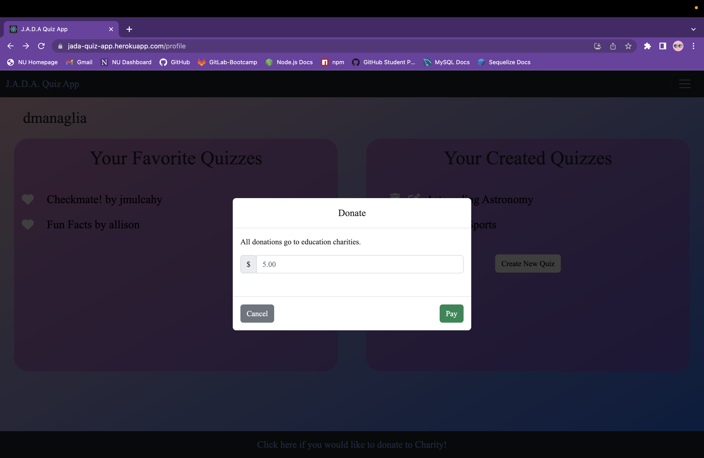

# JADA-Quiz-App

## Description

We created an application for users to create and take different quizzes to test their knowledge. It's a perfect application for anybody who like trivia or for those who need a good place to study for school! Users can even make their quizzes private so that other users cannot see their quiz. 

The JADA Quiz App is a full-stack application that uses Apollo server, GraphQL as our query language, Mongoose and MongoDB for our database, Express for our web framework, and React for our frontend. Our site is styled using Bootstrap.

## Table of Contents 

- [Installation](#installation)
- [Usage](#usage)
- [Credits](#credits)
- [Features](#features)
- [Future-Development](#future-development)
- [License](#license)
- [Collaborators](#collaborators)

## Installation

No installations necessary, just view our deployed link: [Deployed Application](https://jada-quiz-app.herokuapp.com/)

## Usage

  When a new user navigates the JADA Quiz Application they have access to all public quizzes on the application. The homepage presents users with all quizzes grouped by category.
  
  
  Users do not need to be logged in to test their knowledge and take quizzes that other users have created, nor do they need to be logged in to view the highscores for any quiz. However, if they would like to have their scores saved to the scoreboard or if they would like to create their very own quizzes, users need to either sign up or log in. At any point the user can utilize the navbar to navigate to the login page or the register page.

  
  
  

  Once users have either signed up or logged in they will have full access to the website. This includes their very own profile page, the ability to create quizzes, to get their name on the scoreboard for any quiz, and to save any quiz to their favorite quizzes list! Utilize the navbar to view these new pages!
  
  

  From here the website is intuitive and easy to navigate. Checkout our features section for more details on some of our key feature! Most importantly, good luck and have fun!

## Credits

  - [Node](https://nodejs.org/api/documentation.html) for 3rd party packages listed here and in all package.json.

  - [React](https://react.dev/) for front end display.

  - [Bootstrap](https://getbootstrap.com/) for a polished UI and easy styling and spacing of components. Also for build in functionality to key items such as the navbar and modals.

  - [Heroku](https://www.heroku.com/home) to deploy our application to production level.

  - [MongoDB](https://www.mongodb.com/) for non-relational data storage.

  - [Mongoose](https://www.npmjs.com/package/mongoose) for cleaner mongodb syntax and functionality.

  - [Atlas DB](https://www.mongodb.com/cloud/atlas/lp/try4?utm_source=google&utm_campaign=search_gs_pl_evergreen_atlas_general_prosp-brand_gic-null_amers-us_ps-all_desktop_eng_lead&utm_term=mongodb%20atlus&utm_medium=cpc_paid_search&utm_ad=e&utm_ad_campaign_id=1718986498&adgroup=66929790186&cq_cmp=1718986498&gclid=CjwKCAjw586hBhBrEiwAQYEnHV3iGHqiraSfB99N4i8_1RJUqGsrcDv043pZ_L0lbl5rYO75m1VONBoCdmwQAvD_BwE) to create a production level database stored on a server so that heroku can interact with the data.

  - [Express](https://www.npmjs.com/package/express) for backend server functionality.

  - [Apollo Server](https://www.apollographql.com/docs/apollo-server/) to host graphQL.

  - [GraphQL](https://graphql.org/) for mutating database requests and responses.

  - [JSON Web Token](https://www.npmjs.com/package/jsonwebtoken) to generate uniques session token.

  - [Bcrypt](https://www.npmjs.com/package/bcrypt) to hash user passwords.

  - [Dotenv](https://www.npmjs.com/package/dotenv) to safely store sensitive API keys.

  - [Stripe](https://stripe.com/docs/api) for prebuild payment forms that handles security of sensitive user information.

## Features

- Users are remembered for up to two hours so if they leave the page and come back within two hours they will remain logged in.

- When a user attempts to login with wrong username or password they are presented with error messages.

- User can fully customize and personalize their quizzes by making them private and by changing the styling to a specific color they like.
  

- Although donations are still in testing mode, users will soon have the ability to donate money to education charities through the site. By clicking on the link in the footer, users can input how much money they would like to donate at which point they are redirected to a payment form.
  
  

- Highscores are ranked not only by score but by time. An appropriate message is  displayed after the user finishes the quiz alerting them if they got a new personal record, or if they got a new overall high score.
  
  

- Because quizzes are ranked partially by time, it is only fair to allow users to pause the quiz if necessary. The time in which a quiz is paused is not counted towards the amound of time the user took to complete the quiz.
  

- After a user has created a quiz they can at an point update the quiz by clicking the edit button in their profile page. Users can change the privacy setting, the styling, the category, add or remove questions and/or choices, or simply fix any typos. Just be sure to hit 'Save' before leaving the page!
  

- Users can add any quiz they come across to their favorite quizzes list, any they can always unlike a quiz. Users also have the ability to delete any quiz they have created if they so choose. Just be sure you want to delete it since there is no getting it back once its gone!
  

- Users who click on the delete quiz button or the Exit Quiz button are prompted to confirm since these actions result in the loss of data.
  

## Future-Development

While the web application has a great deal of functionality, it was built in less than a week. Given more time our team would like to develop more features and functionality:

- Allow users to choose if a question should be multiple choice or input. We strayed away from this since user inputs would have to match exactly if they were to get the question correct. On trivia night the judges can overlook mispelling of a name or capitalization of a letter, however a computer cannot. For quizzes on math however, this would be a great feature.

- Allow users to share private quizzes with a specific user or users, kind of like a friends list. Although the quiz might be private to the most users on the application it would be nice if the user wanted to share a quiz with their study group for instance.

- Allow the web application to be downloaded. Currently there is no use of cache storage or offline mode. It would be nice to implement this so that users do not need to go online to navigate to the application everytime they wish to study or take a quiz, they could simply pull up the application on their computer even without internet connection.

- Allow users to create a setting page where they can update their username and their overall UI, similarly to how each quiz can have a personal styling it would be nice to allow users to choose their own UI styling.

- Create a 'forgot password link' so that users can be sent an email to change their password if they forget it. This way they won't loose access to any of their favorite quizzes- especially if they wish to update those quizzes or if they are private!

- Create an option when designing quizzes to either display the answer immediately or to keep the answer hidden. Our team remarked as we were testing out each others quizzes how some questions are so fun you wish you could just get the answer right away!

- Going along with this it would be nice to give quiz creators an optional message to display after each question where they could explain the answer.

- Lastly our team thought it would be nice to add a 'Featured Quizzes' list that shows the top 5 or 10 quizzes ranked by how many users have liked each quiz.

## License

This application has the MIT license.

## Collaborators
 
- [Awele Anita Lan](https://github.com/Awele1111)
- [Daniel Managlia](https://github.com/dmanaglia)
- [Jacob Mulcahy](https://github.com/jmulcahy92)
- [Allison Nault](https://github.com/allisonnault)
